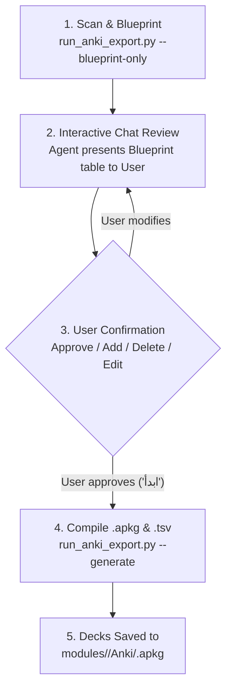

# Medical High-Yield Anki Deck Generator (`transcriber-anki`)

Generates pure English, active-recall **Anki Flashcard Decks (`.apkg`)** and **TSV packages** directly from finalized medical lecture transcripts.

Every card follows the concise **Egyptian Written Exam Model Answer Style** (structured bullets, 1–5 words per point, mark-scheme precision) organized around 7 High-Yield Medical Pillars:

```text
1. 📖 Definitions & Diagnostic Criteria (def)
2. 🗂️ Classifications & Subtypes (types)
3. ⚙️ Pathophysiology & Mechanisms (mechanism)
4. 🔍 Clinical Signs & Buzzwords (signs)
5. 💊 Treatment, Antidotes & Contraindications (TTT)
6. ⚠️ Complications & Timeline of Death (complications)
7. 🎯 Past Exam MCQs, Written & Traps (past_exams)
```

---

## 🔄 The Interactive 3-Step Lifecycle

Whenever the user requests Anki cards for a lecture or module, follow this strict interactive workflow:



### Step 1: Scan & Generate Blueprint

Run the extractor in blueprint mode:

```bash
# For a specific lecture:
python3 skills/transcriber-anki/scripts/run_anki_export.py \
  --workspace "$PWD" --module <module_id> --lecture "<lecture_name>" --blueprint-only

# For all lectures in module:
python3 skills/transcriber-anki/scripts/run_anki_export.py \
  --workspace "$PWD" --module <module_id> --all-lectures --blueprint-only
```

### Step 2: Present Proposed Cards Table to the User

Present the itemized table to the user in chat:

```markdown
وجدت في محاضرة [اسم المحاضرة] هذه النقاط المقترحة للكروت (X كارت):

| # | Pillar | Question (Front) | Key Model Answer Points (Back) |
|---|---|---|---|
| 1 | `def` | Definition & impact of Corrosives | Acute necrosis, Histological destruction, Functional loss |
| 2 | `types` | Modern classification of Corrosives | Acids, Alkalis, Organic, Metallic, Button Batteries |
| 3 | `mechanism` | Acid vs Alkali necrosis | Coagulative (eschar) vs Liquefactive (saponification) |
| 4 | `TTT` | Corrosive TTT & Contraindications | Airway, Cold milk, Endoscopy 12-24h, NO emesis/lavage/neutralization |
| 5 | `complications`| Complications timeline (Day 1, W1, W3) | Shock, Laryngeal edema, Perforation, Stricture |
| 6 | `past_exams`| Early complications of corrosion [2022] | Shock, Airway obstruction, Perforation, Stricture |

هل أبدأ التوليد فوراً، أم ترغب في حذف أي كارت، إضافة نقطة معينة، أو تعديل سؤال؟
```

### Step 3: User Confirmation & Final Compilation

Once the user approves (e.g. *"تمام ابدأ"* or *"ابدأ التوليد"*):

```bash
python3 skills/transcriber-anki/scripts/run_anki_export.py \
  --workspace "$PWD" --module <module_id> --lecture "<lecture_name>" --generate
```

If the user modified or added cards in chat, update the blueprint JSON in `modules/<module_id>/.transcriber-cache/anki_blueprints/<lecture>.blueprint.json` and compile:

```bash
python3 skills/transcriber-anki/scripts/run_anki_export.py \
  --workspace "$PWD" --module <module_id> \
  --from-blueprint "modules/<module_id>/.transcriber-cache/anki_blueprints/<lecture>.blueprint.json"
```

---

## 🎨 Card Anatomy & Styling

- **Front:** Bold English question stem + Category badge pill (`[Treatment / TTT]`, `[Complications]`, `[Past Exam - 2023]`).
- **Back:** Question recap + Structured numbered/bulleted model answer + Distinct red warning box for **Absolute Contraindications**.
- **Visuals:** Pure English, modern rounded card container, full Dark Mode (Night Mode) support.
- **Hierarchical Tags:** `Module::<id>`, `Lecture::<name>`, `Pillar::<category>`, `Badge::<exam_year>`.
