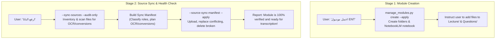

# Transcriber Setup

Utility skill to configure medical modules, resolve NotebookLM projects, initialize canonical folders, and autonomously synchronize, repair, and upload course data.

---

## The 2-Stage Lifecycle



---

## Stage 1: Create Module & Link NotebookLM

When the user says **"اعمل موديول [الاسم]"** or **"ضيف موديول جديد"**:

1. Resolve the module ID (lowercase kebab-case, e.g. `cardiology`, `ent`, `toxo`).
2. Run the module manager with `--apply` (automatically creates or links the matching NotebookLM notebook):
   ```bash
   python3 skills/universal-transcriber/scripts/manage_modules.py \
     --workspace "$PWD" create --module <module_id> --display-name "<Display Name>" \
     --notebook-title "<Display Name>" --apply
   ```
3. Instruct the user clearly:
   > "تم إنشاء الموديول ومجلداته بنجاح! ضع ملفات المحاضرات والسلايدات في مجلد `modules/<module_id>/Lecture/` وملفات الامتحانات وبنوك الأسئلة في `modules/<module_id>/Questions/`، ثم أخبرني **'ارفع الداتا'**."

---

## Stage 2: Synchronize, Repair & Upload Data

When the user says **"ارفع الداتا"**, **"ارفع ملفات الموديول"**, or **"زامن الملفات"**:

1. **Audit & Inventory**: Scan local files and compare with live NotebookLM inventory:
   ```bash
   python3 skills/universal-transcriber/scripts/run_transcription.py \
     --workspace "$PWD" --module <module_id> --sync-sources --audit-only
   ```
2. **Build Sync Manifest**: Author `/tmp/<module_id>-sync-manifest.json` outside Git:
   - Identify files needing OCR (scanned PDFs without text layer) or conversion (PPTX/DOCX → PDF).
   - Classify roles (`slides`, `assessment`, `reference`).
   - Mark `"agent_approved": true`.
3. **Execute Sync, Repair & Deduplication**: Run with `--apply`:
   ```bash
   python3 skills/universal-transcriber/scripts/run_transcription.py \
     --workspace "$PWD" --module <module_id> \
     --source-sync-manifest /tmp/<module_id>-sync-manifest.json --apply
   ```
   *The Agent ensures only one single clean copy exists locally and remotely: redundant unsupported formats (e.g. `.ppsx` when `.pdf` is ready) and broken/corrupted remote files are deleted immediately.*
4. **Confirm Readiness**: Inform the user:
   > "تم رفع ومزامنة جميع ملفات الموديول والتأكد من سلامتها وجاهزيتها 100%! الموديول جاهز الآن للبدء في التفريغ."

---

## References

- [../universal-transcriber/references/modules.md](../universal-transcriber/references/modules.md) — Full `module.json` format and directory hierarchy.
- [../universal-transcriber/references/source-sync-and-manifest.md](../universal-transcriber/references/source-sync-and-manifest.md) — Module-wide source sync and preparation actions.
