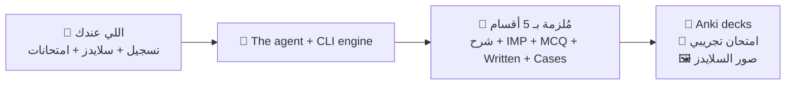
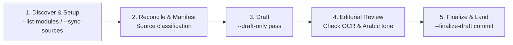
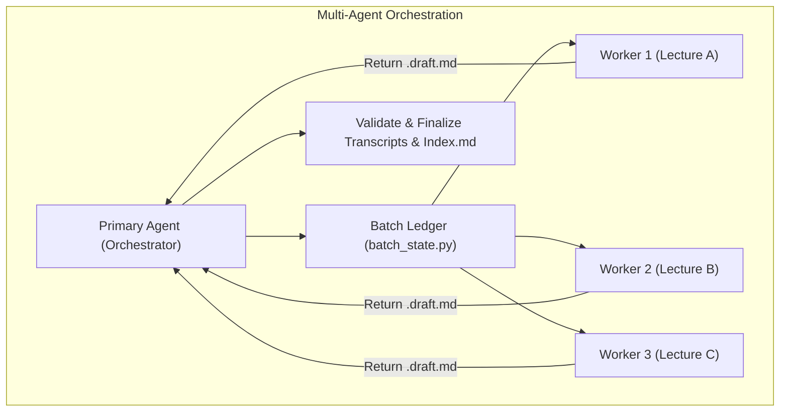

# Universal Medical Lecture Transcriber

[](https://github.com/3omr/universal-transcriber-skill/actions/workflows/tests.yml)
[](https://www.skills.sh/3omr/universal-transcriber-skill)
[](https://github.com/3omr/universal-transcriber-skill/releases/latest)
[](https://www.python.org/)
[](LICENSE)

**حوّل تسجيل المحاضرة إلى مُلزمة مذاكرة كاملة — شرح بالعامية المصرية، مصطلحات إنجليزية، وأسئلة امتحانات حقيقية.**

You record a lecture. You have the doctor's slides, and a folder of past exam papers.
This turns those three things into one organized study guide per lecture — the
explanation in natural Egyptian Arabic, the medical terms in English, and the
questions taken from the papers that were actually set, with the year on each one.

```bash
npx skills add 3omr/universal-transcriber-skill
```

Then just ask your AI agent, in Arabic:

```text
اعمل تفريغ لمحاضرة Corrosives لموديول toxo
```

---

## إيه اللي بيحصل بالظبط / What actually happens

You put your files in a folder. The agent reads them, asks NotebookLM about the
recording, and writes a transcript you can revise from.



**قبل / Before** — a 90-minute recording, 76 slides, and four years of exam PDFs
sitting in a folder, none of it searchable.

**بعد / After** — one markdown file per lecture, in five fixed sections, where
every question carries the year it came from and every claim traces back to
something the doctor actually said.

---

## اللي بتطلعه / What you get

Every finished transcript has the same five sections, always in this order:

| # | Section | إيه اللي جواه |
|---|---|---|
| **1** | 📖 **Chronological Guide** | شرح الدكتور بالكامل بالترتيب، بالعامية المصرية والمصطلحات إنجليزي. مفيش تلخيص ولا حذف. |
| **2** | ⭐ **High-Yield & IMP** | Core Concepts، Diagnostic Rules، Treatment Red Flags، Exam Traps، وجدول ملخص. |
| **3** | ❓ **MCQs** | أسئلة من امتحانات السنين اللي فاتت `**[Past Exams - YYYY]**` + أسئلة high-yield، وكل اختيار غلط مكتوب ليه غلط. |
| **4** | 📝 **Written Questions** | Model answer إنجليزي منظّم، وتحته الشرح بالعامية. |
| **5** | 🏥 **Clinical Cases** | حالات مع الأسئلة الفرعية نصّاً من الامتحانات، والإجابة، وclinical pearls. |

---

## التثبيت / Install

Browse what is in the package before installing anything:

```bash
npx skills add 3omr/universal-transcriber-skill --list
```

Install all three skills, or just one:

```bash
npx skills add 3omr/universal-transcriber-skill
npx skills add 3omr/universal-transcriber-skill --skill universal-transcriber
npx skills add 3omr/universal-transcriber-skill --skill transcriber-anki
```

Install for one agent, or globally:

```bash
npx skills add 3omr/universal-transcriber-skill --agent claude-code
npx skills add 3omr/universal-transcriber-skill --global
```

Works with any agent the [Skills CLI](https://github.com/vercel-labs/skills)
supports. To pin a version, append an existing release tag as `@vMAJOR.MINOR.PATCH`.

<details>
<summary><b>طرق تثبيت تانية / Other install methods</b></summary>

### Clone the repository and work inside it

This is the layout the project is built around — `modules/` holds your course
data, and the skills resolve the workspace with `git rev-parse --show-toplevel`:

```bash
git clone https://github.com/3omr/universal-transcriber-skill.git
cd universal-transcriber-skill
```

Claude Code picks up `skills/` and `AGENTS.md` automatically; Google Antigravity
and Codex pick up the `.agents/skills/` mirror.

### Claude Code, as global skills

Each skill is its own directory, so link them individually — pointing
`~/.claude/skills/<name>` at the repository root would nest `SKILL.md` one level
too deep and Claude Code would not find it:

```bash
git clone https://github.com/3omr/universal-transcriber-skill.git ~/src/universal-transcriber-skill
mkdir -p ~/.claude/skills
for skill in universal-transcriber transcriber-anki transcriber-setup; do
  ln -s ~/src/universal-transcriber-skill/skills/"$skill" ~/.claude/skills/"$skill"
done
```

### Cursor / Windsurf / other editors

Add the repository as a submodule, then reference `skills/<name>/SKILL.md`:

```bash
git submodule add https://github.com/3omr/universal-transcriber-skill.git vendor/universal-transcriber-skill
```

</details>

---

## أول تفريغ / Your first transcript

**1 — اعمل موديول جديد.** Ask the agent; it creates the folders and links a
NotebookLM notebook for you:

```text
اعمل موديول جديد اسمه toxo
```

**2 — حطّ ملفاتك.** Drop your files into the folders it made:

```text
modules/toxo/Lecture/      ← التسجيلات، السلايدز، الكتاب
modules/toxo/Questions/    ← امتحانات السنين اللي فاتت
```

**3 — ارفع الداتا.** The agent inspects every file, runs OCR on scanned papers,
converts slides, and uploads:

```text
ارفع داتا موديول toxo
```

**4 — فرّغ.** One lecture:

```text
اعمل تفريغ لمحاضرة Corrosives لموديول toxo
```

…or the whole module at once, each lecture in its own parallel sub-agent:

```text
فرغ كل محاضرات موديول toxo وخلي كل محاضرة في agent مستقل
```

The finished transcripts land in `modules/toxo/Transcripts/`, with an `Index.md`
listing them.

---

## اللي محتاجه قبل ما تبدأ / Requirements

> **Heads up:** the first-time setup needs a terminal. Once it is done, everything
> after that is plain Arabic prompts to your agent.

The skills call external tools that the skill manager does **not** install for you:

| Tool | Needed for | Install |
| --- | --- | --- |
| **`nlm`** (required) | Every NotebookLM query, upload, and source listing | [github.com/tmc/nlm](https://github.com/tmc/nlm), then `nlm auth` |
| **poppler-utils** (required) | Reading a PDF's text layer to decide whether it needs OCR | `apt install poppler-utils` / `brew install poppler` |
| **ocrmypdf** | OCR for scanned past-exam PDFs with no text layer | `apt install ocrmypdf` / `brew install ocrmypdf` |
| **libreoffice** | Converting PPTX/PPSX/DOCX slides to PDF before upload | `apt install libreoffice` / `brew install --cask libreoffice` |
| **ghostscript** | Compressing PDFs over the NotebookLM upload limit | `apt install ghostscript` / `brew install ghostscript` |
| **ffmpeg** | Normalizing recordings NotebookLM will not accept | `apt install ffmpeg` / `brew install ffmpeg` |

Plus the Python packages (`genanki` for native `.apkg` decks, `reportlab` to
render plain-text question banks as PDFs before upload):

```bash
pip install -r requirements.txt
```

**Then check everything at once.** This exits non-zero if anything required is missing:

```bash
python3 skills/universal-transcriber/scripts/run_transcription.py --doctor
```

`--doctor` only checks that each tool is on your PATH. Presence is not health:
`nlm` can be installed and never have been given credentials, and you would only
find out half an hour into a run. `--doctor-live` actually runs each tool —
including the same `nlm notebook list` call the engine makes first — and fails if
one is installed but not working:

```bash
python3 skills/universal-transcriber/scripts/run_transcription.py --doctor-live
```

Python 3.10 or newer. Linux, macOS and Windows are all supported and all covered by CI.

> On Windows the console defaults to the ANSI code page, which can encode neither
> Arabic nor emoji — that is, none of what this tool prints. The entry points pin
> stdout and stderr to UTF-8 before writing anything, so this is handled for you;
> it is only worth knowing if you embed the scripts somewhere else.

---

## السكيلز التلاتة / The three skills

| Skill | Job |
| --- | --- |
| [`universal-transcriber`](skills/universal-transcriber/SKILL.md) | Transcribe lectures, generate grounded exam questions, and coordinate multi-agent workers. |
| [`transcriber-anki`](skills/transcriber-anki/SKILL.md) | Generate high-yield, 100% English Anki flashcard decks (`.apkg`/`.tsv`) from transcripts. |
| [`transcriber-setup`](skills/transcriber-setup/SKILL.md) | Configure new modules, initialize canonical directories, and link NotebookLM projects. |

Each skill name links to its `SKILL.md`, which owns that skill's own triggers,
flags, and caveats.

---

## حاجات زيادة / Beyond transcripts

### 🎴 Anki decks

Ask for them in Arabic and `transcriber-anki` builds a native `.apkg` from a
finished transcript — 100% English, structured around written-exam model answers.

### 📝 بنك أسئلة الموديول / The module's question bank

A question used to exist only inside the transcript that produced it. That is the
wrong unit for revision — nobody studies one lecture's MCQs the night before a
paper — and it meant nothing could answer *"what has been asked every year since 2022?"*

```bash
python3 skills/universal-transcriber/scripts/run_transcription.py \
  --workspace "$PWD" --module ophtha --question-bank --format xlsx
```

```
Question bank for ophtha: 81 unique of 82 across 4 lecture(s)
  mcq        16 unique /   16 total
  written    52 unique /   53 total
  case       13 unique /   13 total
  1 repeat(s) kept and marked
  past exam years -- 2022: 8, 2023: 14, 2024: 17, 2025: 14
```

Repeats are **marked, not dropped**: the same question appearing in several
lectures says something about what the examiners care about, and the canonical
copy absorbs every year its repeats claimed. Exam sampling then uses that as a weight.

### 🎯 امتحان تجريبي / Sitting a mock exam

```bash
python3 skills/universal-transcriber/scripts/run_transcription.py \
  --workspace "$PWD" --module ophtha --exam --count 50 --years 2020-2024
```

Writes the paper and the answer key as **two** files — a paper with the answers
under each question cannot be sat. Questions are drawn a lecture at a time in
rotation so one lecture cannot dominate, and within a lecture the ones that recur
across years come first.

`--format html` instead writes a single self-contained page that marks itself: no
dependency, no network, no build step — one file you can open on a phone.
`--seed` makes a paper reproducible.

| `--format` | needs |
| --- | --- |
| `md` (default), `csv`, `json`, `html` | nothing |
| `xlsx` | `pip install openpyxl` |
| `docx` | `pip install python-docx` |

### 🖼️ صور السلايدز / Slide figures

Slides reach NotebookLM as text, so every picture in them — the anatomy diagram,
the gonioscopy view, the photo of the antidote box — is gone by the time a
transcript is written. In ophthalmology and toxicology that is most of the teaching.

```bash
python3 skills/universal-transcriber/scripts/run_transcription.py \
  --workspace "$PWD" --module toxo --lecture "OPs" --extract-figures
```

This renders the diagram pages into `Transcripts/Figures/<lecture>/` and prints the
markdown to paste into the transcript. A page counts as a diagram when it has
almost no extractable text **and** actually embeds an image — the second test is
what stops a section divider reading just "Warfarin" from being rendered as a
blank slide with a title. On a real 76-slide deck that selects nine pages.

Pass `--slides` to point at a specific deck, `--all-slide-pages` to render
everything, and `--figure-resolution` to change the DPI (default 150).

### 🔍 مراجعة تفريغات موديول / Checking a module's transcripts

```bash
scripts/audit-transcripts.sh toxo
```

Prints one row per transcript: section count, MCQ/written/IMP/combined-badge
counts, question coverage against `Questions/`, and how many `###` headings
repeat. A `LOW` mark means the extraction looks thin next to the rest of the
module and is worth re-running — it is a prompt to look, not a verdict.

---

<details>
<summary><h2 style="display:inline">🔧 Advanced — raw transcripts, config, and the CLI</h2></summary>

### Getting the raw transcript, and writing the sections yourself

The default pipeline asks NotebookLM to *answer questions about* the recording:
the five sections are written by a model that has read the audio, behind a prompt,
out of reach. Two engines take the other half of the deal instead — they return
**what was said, verbatim**, and stop. The Agent writes the five sections from
that text, in the open, where every claim can be checked against a line sitting
in the repo.

That division is deliberate. Restructuring the recording before anyone has read it
would mean paraphrasing the doctor, and the doctor's exact wording is the one
thing the exam-style prompts treat as authoritative — `الدكتور قال نصاً` is a
claim the transcript makes, and it has to stay true.

Both write `<lecture>.verbatim.md` and neither produces the 5-section format.

#### `--engine notebooklm-raw` — read back what NotebookLM already transcribed

```bash
python3 skills/universal-transcriber/scripts/run_transcription.py \
  --workspace "$PWD" --module radio --engine notebooklm-raw --lecture "مراجعه اشعه"
```

NotebookLM transcribes every audio source it ingests. This reads that transcript
back with `nlm content source`, which is explicitly *no AI processing*, and hands
it over unedited.

It is the cheapest path by a wide margin: **nothing new to install** (`nlm` is
already required), no model download, no CUDA, and it returns in seconds because
the recording was transcribed when it was uploaded. It is also the same
recognition NotebookLM itself reasons over, so the raw text and the phase answers
cannot disagree about what was said.

What it gives up is timestamps — `nlm content source` returns prose, not segments,
so `--timestamps` has nothing to render. It also needs the recording already
uploaded to the module's notebook.

#### `--engine whisper` — recognise the audio locally

```bash
python3 skills/universal-transcriber/scripts/run_transcription.py \
  --workspace "$PWD" --module toxo --engine whisper --lecture "OPs" --timestamps
```

No account, no upload, no network, and no dependency on an unofficial API staying
up — the answer to "what happens the day `nlm` breaks". It is the only one of the
two that produces timestamps.

Needs `pip install faster-whisper`. `--whisper-model` picks the model size
(default `medium`; the lectures switch between Arabic and English mid-sentence and
the smaller models get the drug names wrong). Leave `--language` unset so the
recogniser follows the recording rather than being pinned to one language. Expect
it to take about as long as the lecture on CPU.

### Configuration

The engine reads `config.json` next to the scripts. Start from the example:

```bash
cp skills/universal-transcriber/scripts/config.example.json skills/universal-transcriber/scripts/config.json
```

Everything in it is optional — the defaults work — but this is where an `nlm`
profile, a non-default `nlm` path, and the modules/transcripts roots live. If the
file exists but is not valid JSON the run says so and continues on defaults rather
than ignoring it quietly.

| Key | Effect |
| --- | --- |
| `nlm_executable` / `nlm_profile` | Which `nlm` binary and auth profile every query uses |
| `modules_root` / `transcripts_root` | Where modules and their transcripts live |
| `default_subject` | Subject name when the engine is run directly instead of through the launcher |
| `emoji_by_subject` | Emoji appended to each transcript filename |
| `question_coverage_blocks` | `true` makes a below-floor question yield fail the run instead of warning |

### Quick CLI reference

```bash
# 0. Verify external tooling (exits non-zero if anything required is missing)
python3 skills/universal-transcriber/scripts/run_transcription.py --doctor

# 1. List available medical modules
python3 skills/universal-transcriber/scripts/run_transcription.py --workspace "$PWD" --list-modules

# 2. Audit module sources (read-only preflight)
python3 skills/universal-transcriber/scripts/run_transcription.py \
  --workspace "$PWD" --module toxo --sync-sources --audit-only

# 3. Generate draft with source manifest
python3 skills/universal-transcriber/scripts/run_transcription.py \
  --workspace "$PWD" --module toxo \
  --source-manifest /tmp/corrosives-manifest.json --draft-only

# 4. Finalize reviewed draft
python3 skills/universal-transcriber/scripts/run_transcription.py \
  --workspace "$PWD" --module toxo \
  --source-manifest /tmp/corrosives-manifest.json --finalize-draft
```

### Architecture & workflow

The transcription engine runs a strict 5-step cycle. The AI Agent owns source
reconciliation, style judgment, and editorial review; the underlying CLI engine
deterministically executes conversions, OCR, NotebookLM queries, and validation passes.





### Directory hierarchy

```text
universal-medical-lecture-transcriber/
├── AGENTS.md                              # Agent instructions, conventions, and terminology
├── VERSION                                # Single source of truth for the release version
├── requirements.txt                       # Python dependencies (genanki)
├── skills.sh.json                         # Skills registry configuration
├── skills/                                # Source tree for all three skills
│   ├── universal-transcriber/
│   │   ├── SKILL.md                       # Streamlined 5-step transcription skill
│   │   ├── references/                    # Progressive disclosure reference guides
│   │   └── scripts/                       # CLI launcher, engine, and state helpers
│   ├── transcriber-anki/                  # Flashcard generation skill
│   └── transcriber-setup/                 # Module & notebook configuration skill
├── .agents/skills/                        # Generated mirror of skills/ for Antigravity & Codex
├── scripts/                               # Maintenance: version bump, mirror sync & drift check
├── modules/                               # Canonical storage for medical modules (gitignored)
│   └── toxo/
│       ├── module.json
│       ├── Lecture/                       # Audio recordings, slides, textbooks
│       ├── Questions/                     # Past exams and question banks
│       └── Transcripts/                   # Finalized markdown transcripts & Index.md
└── tests/                                 # Unit & integration tests
```

</details>

---

## References & deep dives

- [**Source Sync & Manifests**](skills/universal-transcriber/references/source-sync-and-manifest.md) — Live inventory matching, OCR/conversions, and JSON manifest schemas.
- [**Drafting & Editorial Guidelines**](skills/universal-transcriber/references/drafting-and-editorial.md) — 5-section transcript standard and Egyptian Arabic tone guidelines.
- [**Exam Style & Grounded Questions**](skills/universal-transcriber/references/exam-style.md) — Past exam sampling, question deduplication, and badge rules.
- [**Multi-Agent Orchestration**](skills/universal-transcriber/references/multi-agent.md) — Native sub-agent worker packets, batch ledger, and capacity scheduling.
- [**Module Management**](skills/universal-transcriber/references/modules.md) — `module.json` schema, folder structure, and setup CLI.

---

## Releases

The version is not bumped by hand. Merging a pull request cuts the release, and
the PR **title** decides which one:

| title prefix | result | example |
| --- | --- | --- |
| `feat:` | minor | 1.4.0 → 1.5.0 |
| `fix:` `perf:` `refactor:` `revert:` | patch | 1.4.0 → 1.4.1 |
| `feat!:` or a `BREAKING CHANGE:` footer | major | 1.4.0 → 2.0.0 |
| `chore:` `docs:` `ci:` `test:` `build:` `style:` | no release | 1.4.0 stays |

A `release:major` / `release:minor` / `release:patch` / `release:skip` label
overrides the title. A bot comments the planned version on every PR, so the answer
is visible before anyone clicks merge.

The in-app update notifier polls the latest **GitHub release tag**, which is why a
merge that cuts no release reaches nobody who installed the skill. Set
`UNIVERSAL_TRANSCRIBER_NO_UPDATE_CHECK=1` to silence it.

---

## Contributing

Edit `skills/` only. `.agents/skills/` is a generated mirror; regenerate it and
bump versions with the maintenance scripts, and CI fails if the two drift:

```bash
bash scripts/sync-agents-mirror.sh     # regenerate .agents/skills from skills/
bash scripts/check-agents-mirror.sh    # verify they match (runs in CI)
bash scripts/check-shared-files.sh     # verify duplicated files match (runs in CI)
bash scripts/bump-version.sh 1.4.0     # set VERSION and both fallback constants
python3 -m unittest discover -s tests -t tests
ruff check . && mypy                   # lint and type check (both run in CI)
```

A few files are duplicated across skills on purpose — each skill has to stand
alone when it is linked into `~/.claude/skills/<name>`, so it cannot import a
helper from a sibling. `check-shared-files.sh` is what stops those copies from
drifting apart.

---

## License

Released under the [MIT License](LICENSE).
