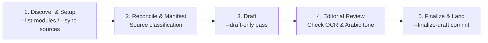
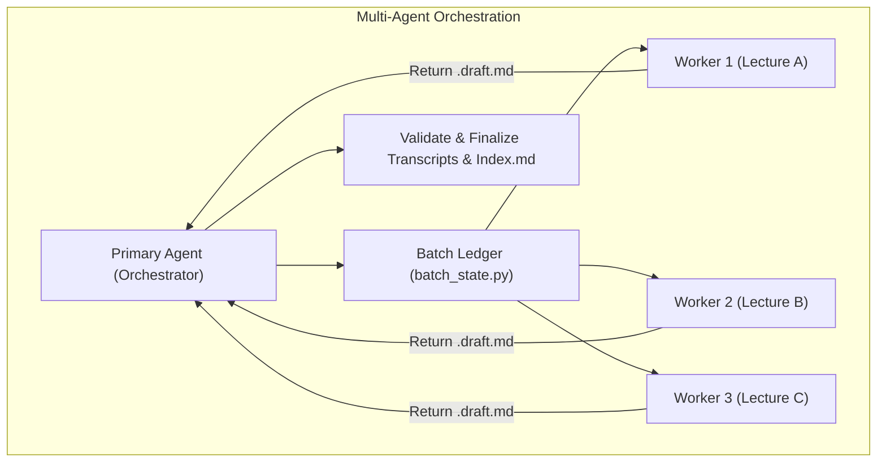

# Universal Medical Lecture Transcriber

[](https://github.com/3omr/universal-transcriber-skill/releases/latest)
[](https://github.com/3omr/universal-transcriber-skill)
[](skills.sh.json)
[](https://www.python.org/)
[](https://github.com/3omr/universal-transcriber-skill/stargazers)
[](#license)

**Turn medical lecture recordings, slides, question banks, and past exams into structured, authoritative 5-section study guides blending detailed Egyptian Arabic explanations with English medical terminology.**

---

## 📋 Prerequisites

The skills shell out to external tooling that is **not** installed by the skill
manager. Install these before your first transcription:

| Tool | Needed for | Install |
| --- | --- | --- |
| **`nlm`** (required) | Every NotebookLM query, upload, and source listing | [github.com/tmc/nlm](https://github.com/tmc/nlm), then `nlm auth` |
| **poppler-utils** (required) | Reading a PDF's text layer to decide whether it needs OCR | `apt install poppler-utils` / `brew install poppler` |
| **ocrmypdf** | OCR for scanned past-exam PDFs with no text layer | `apt install ocrmypdf` / `brew install ocrmypdf` |
| **libreoffice** | Converting PPTX/PPSX/DOCX slides to PDF before upload | `apt install libreoffice` / `brew install --cask libreoffice` |
| **ghostscript** | Compressing PDFs over the NotebookLM upload limit | `apt install ghostscript` / `brew install ghostscript` |
| **ffmpeg** | Normalizing recordings NotebookLM will not accept | `apt install ffmpeg` / `brew install ffmpeg` |

Python packages (`genanki` for native `.apkg` decks, `reportlab` to render
plain-text question banks as PDFs before upload):

```bash
pip install -r requirements.txt
```

Then verify everything at once — this exits non-zero if anything required is missing:

```bash
python3 skills/universal-transcriber/scripts/run_transcription.py --doctor
```

Python 3.10 or newer is required.

### Configuration

The engine reads `config.json` next to the scripts. Start from the example:

```bash
cp skills/universal-transcriber/scripts/config.example.json skills/universal-transcriber/scripts/config.json
```

Everything in it is optional — the defaults work — but this is where an `nlm`
profile, a non-default `nlm` path, and the modules/transcripts roots live. If
the file exists but is not valid JSON the run says so and continues on
defaults rather than ignoring it quietly.

| Key | Effect |
| --- | --- |
| `nlm_executable` / `nlm_profile` | Which `nlm` binary and auth profile every query uses |
| `modules_root` / `transcripts_root` | Where modules and their transcripts live |
| `default_subject` | Subject name when the engine is run directly instead of through the launcher |
| `emoji_by_subject` | Emoji appended to each transcript filename |
| `question_coverage_blocks` | `true` makes a below-floor question yield fail the run instead of warning |

### Checking a module's transcripts

```bash
scripts/audit-transcripts.sh toxo
```

Prints one row per transcript: section count, MCQ/written/IMP/combined-badge
counts, question coverage against `Questions/`, and how many `###` headings
repeat. A `LOW` mark means the extraction looks thin next to the rest of the
module and is worth re-running — it is a prompt to look, not a verdict.

---

## ⚡ Quick Install (تثبيت السكيل)

### Option 1: skills.sh / Universal AI Agent CLI (Recommended)
```bash
npx skills add 3omr/universal-transcriber-skill
```

### Option 2: Clone the repository and work inside it

This is the layout the project is built around — `modules/` holds your course
data, and the skills resolve the workspace with `git rev-parse --show-toplevel`:

```bash
git clone https://github.com/3omr/universal-transcriber-skill.git
cd universal-transcriber-skill
```

Claude Code picks up `skills/` and `AGENTS.md` automatically; Google Antigravity
and Codex pick up the `.agents/skills/` mirror.

### Option 3: Claude Code (global skills)

Each skill is its own directory, so link them individually — pointing
`~/.claude/skills/<name>` at the repository root would nest `SKILL.md` one level
too deep and Claude Code would not find it:

```bash
git clone https://github.com/3omr/universal-transcriber-skill.git ~/src/universal-transcriber-skill
mkdir -p ~/.claude/skills
for skill in universal-transcriber transcriber-anki transcriber-setup; do
  ln -s ~/src/universal-transcriber-skill/skills/"$skill" ~/.claude/skills/"$skill"
done
```

### Option 4: Cursor / Windsurf / other editors

Add the repository as a submodule, then reference `skills/<name>/SKILL.md`:

```bash
git submodule add https://github.com/3omr/universal-transcriber-skill.git vendor/universal-transcriber-skill
```

---

## 🚀 How to Prompt Your Agent (طريقة الاستخدام)

Once installed, simply prompt your AI agent:

```text
اعمل تفريغ لمحاضرة Corrosives لموديول toxo
```

Or orchestrate an entire medical module in parallel with native sub-agents:

```text
فرغ كل محاضرات موديول toxo وخلي كل محاضرة في agent مستقل
```

---

## Architecture & Workflow

The transcription engine runs a strict 5-step cycle. The AI Agent owns source reconciliation, style judgment, and editorial review; the underlying CLI engine deterministically executes conversions, OCR, NotebookLM queries, and validation passes.





---

## Available Skills

| Skill | Description | Location |
| --- | --- | --- |
| [`universal-transcriber`](skills/universal-transcriber/SKILL.md) | Transcribe lectures, generate grounded exam questions, and coordinate multi-agent workers. | `skills/universal-transcriber/` |
| [`transcriber-anki`](skills/transcriber-anki/SKILL.md) | Generate high-yield, 100% English Anki flashcard decks (.apkg/.tsv) from transcripts. | `skills/transcriber-anki/` |
| [`transcriber-setup`](skills/transcriber-setup/SKILL.md) | Configure new modules, initialize canonical directories, and link NotebookLM projects. | `skills/transcriber-setup/` |

---

## The 5-Section Academic Standard

Every finalized lecture transcript strictly adheres to five structured sections:

| # | Section | Key Characteristics |
|---|---|---|
| **1** | **📖 Chronological Guide** | Complete, uncompressed coverage of the doctor's spoken explanations in natural Egyptian Arabic with English medical terms. |
| **2** | **⭐ High-Yield Summary & IMP Points** | 5 core subsections: Core Concepts, Diagnostic Rules, Treatment Red Flags, Exam Traps, and Summary Table. |
| **3** | **❓ Multiple Choice Questions (MCQs)** | Grounded past exam MCQs (`**[Past Exams - YYYY]**`) and high-yield items with distractor rationales. |
| **4** | **📝 Written Questions** | Structured English model answers with sub-bullets followed by Egyptian Arabic clinical rationales. |
| **5** | **🏥 Clinical Cases** | Real-world clinical vignettes with verbatim sub-questions from past exams, model answers, and clinical pearls. |

---

## Quick CLI Reference

```bash
# 0. Verify external tooling (exits non-zero if anything required is missing)
python3 skills/universal-transcriber/scripts/run_transcription.py --doctor

# 1. List available medical modules
python3 skills/universal-transcriber/scripts/run_transcription.py --workspace "$PWD" --list-modules

# 2. Audit module sources (read-only preflight)
python3 skills/universal-transcriber/scripts/run_transcription.py \
  --workspace "$PWD" --module toxo --sync-sources --audit-only

# 3. Generate draft with source manifest
python3 skills/universal-transcriber/scripts/run_transcription.py \
  --workspace "$PWD" --module toxo \
  --source-manifest /tmp/corrosives-manifest.json --draft-only

# 4. Finalize reviewed draft
python3 skills/universal-transcriber/scripts/run_transcription.py \
  --workspace "$PWD" --module toxo \
  --source-manifest /tmp/corrosives-manifest.json --finalize-draft
```

---

## Directory Hierarchy

```text
universal-medical-lecture-transcriber/
├── AGENTS.md                              # Agent instructions, conventions, and terminology
├── VERSION                                # Single source of truth for the release version
├── requirements.txt                       # Python dependencies (genanki)
├── skills.sh.json                         # Skills registry configuration
├── skills/                                # Source tree for all three skills
│   ├── universal-transcriber/
│   │   ├── SKILL.md                       # Streamlined 5-step transcription skill
│   │   ├── references/                    # Progressive disclosure reference guides
│   │   └── scripts/                       # CLI launcher, engine, and state helpers
│   ├── transcriber-anki/                  # Flashcard generation skill
│   └── transcriber-setup/                 # Module & notebook configuration skill
├── .agents/skills/                        # Generated mirror of skills/ for Antigravity & Codex
├── scripts/                               # Maintenance: version bump, mirror sync & drift check
├── modules/                               # Canonical storage for medical modules (gitignored)
│   └── toxo/
│       ├── module.json
│       ├── Lecture/                       # Audio recordings, slides, textbooks
│       ├── Questions/                     # Past exams and question banks
│       └── Transcripts/                   # Finalized markdown transcripts & Index.md
└── tests/                                 # Unit & integration tests
```

---

## References & Deep Dives

- [**Source Sync & Manifests**](skills/universal-transcriber/references/source-sync-and-manifest.md) — Live inventory matching, OCR/conversions, and JSON manifest schemas.
- [**Drafting & Editorial Guidelines**](skills/universal-transcriber/references/drafting-and-editorial.md) — 5-section transcript standard and Egyptian Arabic tone guidelines.
- [**Exam Style & Grounded Questions**](skills/universal-transcriber/references/exam-style.md) — Past exam sampling, question deduplication, and badge rules.
- [**Multi-Agent Orchestration**](skills/universal-transcriber/references/multi-agent.md) — Native sub-agent worker packets, batch ledger, and capacity scheduling.
- [**Module Management**](skills/universal-transcriber/references/modules.md) — `module.json` schema, folder structure, and setup CLI.

---

## Contributing

Edit `skills/` only. `.agents/skills/` is a generated mirror; regenerate it and
bump versions with the maintenance scripts, and CI fails if the two drift:

```bash
bash scripts/sync-agents-mirror.sh     # regenerate .agents/skills from skills/
bash scripts/check-agents-mirror.sh    # verify they match (runs in CI)
bash scripts/bump-version.sh 1.4.0     # set VERSION and both fallback constants
python3 -m unittest discover -s tests -t tests
```

---

## License

MIT License.
