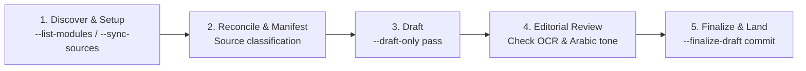
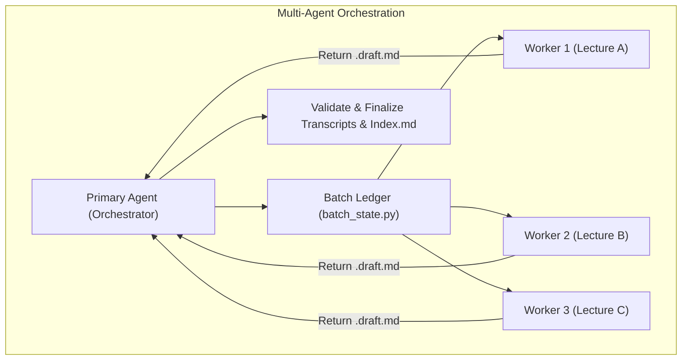

# Universal Medical Lecture Transcriber

[](https://www.python.org/)
[](skills.sh.json)
[](LICENSE)

**Turn medical lecture recordings, slides, question banks, and past exams into structured, authoritative 5-section study guides blending detailed Egyptian Arabic explanations with English medical terminology.**

```bash
# Add skill to your AI Agent
npx skills add 3omr/universal-transcriber-skill
```

Then ask your agent:

```text
اعمل تفريغ لمحاضرة Corrosives لموديول toxo
```

Or run an entire module in parallel with native sub-agents:

```text
فرغ كل محاضرات موديول toxo وخلي كل محاضرة في agent مستقل
```

---

## Architecture & Workflow

The transcription engine runs a strict 5-step cycle. The AI Agent owns source reconciliation, style judgment, and editorial review; the underlying CLI engine deterministically executes conversions, OCR, NotebookLM queries, and validation passes.





---

## Available Skills

| Skill | Description | Location |
| --- | --- | --- |
| [`universal-transcriber`](skills/universal-transcriber/SKILL.md) | Transcribe lectures, generate grounded exam questions, and coordinate multi-agent workers. | `skills/universal-transcriber/` |
| [`transcriber-setup`](skills/transcriber-setup/SKILL.md) | Configure new modules, initialize canonical directories, and link NotebookLM projects. | `skills/transcriber-setup/` |

---

## The 5-Section Academic Standard

Every finalized lecture transcript strictly adheres to five structured sections:

| # | Section | Key Characteristics |
|---|---|---|
| **1** | **📖 Chronological Guide** | Complete, uncompressed coverage of the doctor's spoken explanations in natural Egyptian Arabic with English medical terms. |
| **2** | **⭐ High-Yield Summary & IMP Points** | 5 core subsections: Core Concepts, Diagnostic Rules, Treatment Red Flags, Exam Traps, and Summary Table. |
| **3** | **❓ Multiple Choice Questions (MCQs)** | Grounded past exam MCQs (`**[Past Exams - YYYY]**`) and high-yield items with distractor rationales. |
| **4** | **📝 Written Questions** | Structured English model answers with sub-bullets followed by Egyptian Arabic clinical rationales. |
| **5** | **🏥 Clinical Cases** | Real-world clinical vignettes with verbatim sub-questions from past exams, model answers, and clinical pearls. |

---

## Quick CLI Reference

```bash
# 1. List available medical modules
python3 skills/universal-transcriber/scripts/run_transcription.py --workspace "$PWD" --list-modules

# 2. Audit module sources (read-only preflight)
python3 skills/universal-transcriber/scripts/run_transcription.py \
  --workspace "$PWD" --module toxo --sync-sources --audit-only

# 3. Generate draft with source manifest
python3 skills/universal-transcriber/scripts/run_transcription.py \
  --workspace "$PWD" --module toxo \
  --source-manifest /tmp/corrosives-manifest.json --draft-only

# 4. Finalize reviewed draft
python3 skills/universal-transcriber/scripts/run_transcription.py \
  --workspace "$PWD" --module toxo \
  --source-manifest /tmp/corrosives-manifest.json --finalize-draft
```

---

## Directory Hierarchy

```text
universal-medical-lecture-transcriber/
├── AGENTS.md                              # Agent instructions, conventions, and terminology
├── skills.sh.json                         # Skills registry configuration
├── skills/
│   ├── universal-transcriber/
│   │   ├── SKILL.md                       # Streamlined 5-step transcription skill
│   │   ├── references/                    # Progressive disclosure reference guides
│   │   │   ├── source-sync-and-manifest.md
│   │   │   ├── drafting-and-editorial.md
│   │   │   ├── exam-style.md
│   │   │   ├── multi-agent.md
│   │   │   └── modules.md
│   │   └── scripts/                       # CLI runners and state helpers
│   └── transcriber-setup/
│       └── SKILL.md                       # Setup skill for module & notebook configuration
├── modules/                               # Canonical storage for medical modules
│   └── toxo/
│       ├── module.json
│       ├── Lecture/                       # Audio recordings, slides, textbooks
│       ├── Questions/                     # Past exams and question banks
│       └── Transcripts/                   # Finalized markdown transcripts & Index.md
└── tests/                                 # Unit & integration tests
```

---

## References & Deep Dives

- [**Source Sync & Manifests**](skills/universal-transcriber/references/source-sync-and-manifest.md) — Live inventory matching, OCR/conversions, and JSON manifest schemas.
- [**Drafting & Editorial Guidelines**](skills/universal-transcriber/references/drafting-and-editorial.md) — 5-section transcript standard and Egyptian Arabic tone guidelines.
- [**Exam Style & Grounded Questions**](skills/universal-transcriber/references/exam-style.md) — Past exam sampling, question deduplication, and badge rules.
- [**Multi-Agent Orchestration**](skills/universal-transcriber/references/multi-agent.md) — Native sub-agent worker packets, batch ledger, and capacity scheduling.
- [**Module Management**](skills/universal-transcriber/references/modules.md) — `module.json` schema, folder structure, and setup CLI.

---

## License

MIT License.
