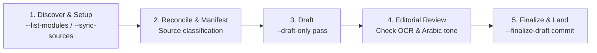

# Universal Medical Lecture Transcriber

Transforms medical lecture recordings, slides, question banks, and past exams into authoritative, structured 5-section study transcripts blending detailed **Egyptian Arabic explanations** with **English medical terminology**.

The Agent supervises source reconciliation, editorial review, and quality gates. The underlying CLI launcher deterministically executes conversions, OCR, NotebookLM queries, and validation passes.

---

## When to Use

- Transcribing single or multipart lecture audio recordings for a medical module.
- Running full-module batch transcriptions with native sub-agents.
- Auditing and synchronizing local slides, notes, and past exam PDFs with NotebookLM projects.
- Generating grounded exam questions (MCQs, written questions, and clinical cases) directly tied to past exam papers.

---

## The 5-Step Loop

Follow these five steps for every transcription task:



### 1. Discover & Setup

Identify the target module and verify source synchronization:

```bash
# List available modules
python3 skills/universal-transcriber/scripts/run_transcription.py --workspace "$PWD" --list-modules

# Audit local and remote source synchronization (read-only)
python3 skills/universal-transcriber/scripts/run_transcription.py \
  --workspace "$PWD" --module <module_id> --sync-sources --audit-only
```

*For new module creation or initial source uploads, see [references/source-sync-and-manifest.md](references/source-sync-and-manifest.md).*

### 2. Reconcile & Manifest

Inspect the module's live inventory and author a temporary lecture manifest outside Git (e.g. `/tmp/<lecture>-manifest.json`):

1. **Audio**: Group ordered parts into a single lecture unit (e.g. `["Corrosive 1.m4a", "Corrosive 2.m4a"]`).
2. **Slides & References**: Pair corresponding slides and mark textbook references (`action: "auto"` or `"use_remote"`).
3. **Assessment Files**: Classify files under `Questions/` as `past_exam` (with verified `year`) or `question_bank`.
4. **Exam Style**: Include observed question patterns in `exam_style_profile`.

*Full manifest schema and examples: [references/source-sync-and-manifest.md](references/source-sync-and-manifest.md).*

### 3. Draft & Agent In-Flight Repair

Run the launcher in draft mode to execute preparation (conversions/OCR), upload necessary files, query NotebookLM, and produce an evidence-rich `.draft.md`:

```bash
python3 skills/universal-transcriber/scripts/run_transcription.py \
  --workspace "$PWD" --module <module_id> \
  --source-manifest /tmp/<lecture>-manifest.json --draft-only
```

The draft runs sequentially through all five sections:
`📖 Chronological Guide → ⭐ IMP Points → ❓ MCQs → 📝 Written Questions → 🏥 Clinical Cases`.

> [!IMPORTANT]
> **No Wasteful LLM Retries**: If a phase query returns raw text containing minor OCR artifacts (joined words, split letters) or duplicate questions from multiple exam years, **do not make repeated queries to NotebookLM**. The Agent takes the candidate response directly, repairs the OCR and merges/formats the questions with canonical badges, and applies the repaired response immediately via `--recovery-response` or direct draft editing.

### 4. Editorial Review & Source Deduplication

Open and review the generated `.draft.md` before finalization:

- **Chronological Guide**: Verify complete preservation of the doctor's spoken explanations, sequence, examples, and Egyptian Arabic dialogue. Never summarize or compress this section.
- **OCR Normalization & Duplicate Resolution**: Restore damaged characters or split option labels (`- **a.**`). Merge identical questions across years into single blocks with ascending badges (e.g. `**[Past Exams - 2021, 2022, 2023]**`). Do not rewrite source questions.
- **Answer Alignment**: Confirm `Correct Answer` matches the option letter and that the clinical explanation aligns.
- **Clean Single Copy**: Ensure redundant local files (e.g. unsupported `.ppsx` when `.pdf` is ready) and broken remote sources are deleted immediately so only one clean source exists both locally and on NotebookLM.

*Full editorial checklist: [references/drafting-and-editorial.md](references/drafting-and-editorial.md).*

### 5. Finalize & Land

Execute the finalization pass. The launcher validates all five sections, atomically writes the final transcript and updates `Index.md`, and removes the temporary draft:

```bash
python3 skills/universal-transcriber/scripts/run_transcription.py \
  --workspace "$PWD" --module <module_id> \
  --source-manifest /tmp/<lecture>-manifest.json --finalize-draft
```

Verify that the transcript exists under `modules/<module_id>/Transcripts/` and has a single row in `Index.md`.

---

## Multi-Lecture Delegation

When handling two or more lectures in one request:
1. Initialize the batch ledger using `scripts/batch_state.py`.
2. Spawn **one native sub-agent worker per lecture unit** (not per audio file).
3. Workers run `--draft-only` and return their `.draft.md`.
4. The primary agent performs editorial review, runs `--finalize-draft`, and commits the transcripts.

*Complete multi-agent specification: [references/multi-agent.md](references/multi-agent.md).*

---

## References

- [references/source-sync-and-manifest.md](references/source-sync-and-manifest.md) — Module sync, live inventory reconciliation, OCR/conversions, and JSON manifest schemas.
- [references/drafting-and-editorial.md](references/drafting-and-editorial.md) — 5-section transcript standard, Egyptian Arabic tone guidelines, and validation gates.
- [references/exam-style.md](references/exam-style.md) — Past exam sampling, MCQ/written pattern capture, and duplicate merging rules.
- [references/multi-agent.md](references/multi-agent.md) — Sub-agent worker packet, ledger lifecycle, capacity scheduling, and fan-in acceptance.
- [references/modules.md](references/modules.md) — Directory layout, `module.json` schema, and module management CLI.
