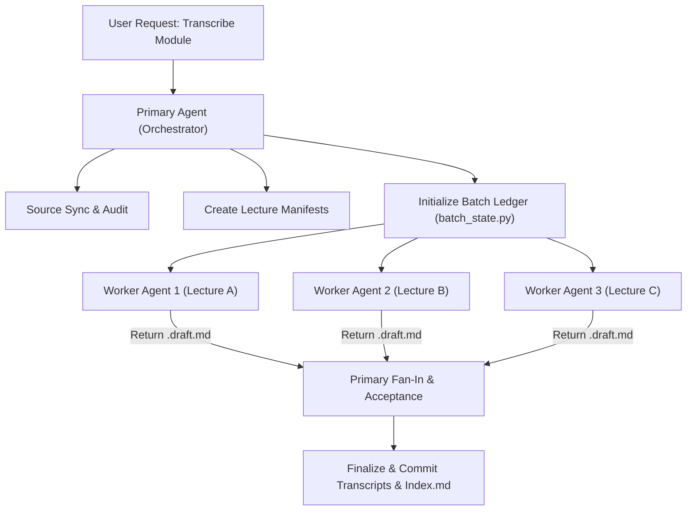

# Multi-Lecture Sub-Agent Orchestration

When a user requests transcribing multiple lectures (or an entire module), orchestrate execution using host native sub-agents.



---

## 1. Principles and Boundaries

- **One Unit per Worker**: Allocate one resolved lecture unit (which may contain multiple ordered audio parts) per worker agent. Never blindly spawn one worker per audio file.
- **Worker Scope**: Workers produce and review their `.draft.md` using `--draft-only`. Workers **must never** finalize, edit `Index.md`, commit Git changes, or call `nlm` directly.
- **Primary Agent Ownership**: The primary agent manages the ledger, coordinates sub-agents, reviews returned drafts, executes `--finalize-draft`, and updates `Index.md`.

---

## 2. Batch Ledger (`batch_state.py`)

Store orchestration state under `modules/<module_id>/.transcriber-cache/batches/`.

### Initialize Ledger
```bash
python3 skills/universal-transcriber/scripts/batch_state.py init \
  --module toxo \
  --cache-root modules/toxo/.transcriber-cache \
  --manifest /tmp/toxo-corrosives.json \
  --manifest /tmp/toxo-volatile-poisons.json
```

### State Lifecycle
```text
manifest_ready → queued → running → draft_ready → accepted → finalized → verified
```

### Update State
```bash
python3 skills/universal-transcriber/scripts/batch_state.py update \
  --ledger modules/toxo/.transcriber-cache/batches/<BATCH_ID>/batch.json \
  --lecture-key <LECTURE_KEY> --status queued
```

---

## 3. Worker Packet Specification

Dispatch each worker with a bounded task instruction:

```text
ROLE: Own one medical lecture draft. Do not delegate or work on other lectures.

OBJECTIVE:
Produce and editorially review the evidence-rich draft for <TITLE>.
Stop before --finalize-draft and return a handoff to the primary agent.

OWNERSHIP:
- Module: <MODULE_ID>
- Lecture key: <LECTURE_KEY>
- Ordered recordings: <RECORDING_SOURCES>
- Manifest: <ABSOLUTE_MANIFEST_PATH>

COMMAND CONTRACT:
Run: python3 skills/universal-transcriber/scripts/run_transcription.py \
  --workspace "$PWD" --module <MODULE_ID> \
  --source-manifest <ABSOLUTE_MANIFEST_PATH> --draft-only

EDITORIAL CONTRACT:
Keep the Chronological Guide complete in natural Egyptian Arabic + English medical terms.
Review MCQs, Written Questions, and Clinical Cases against the 5-section transcript standard.

RETURN HANDOFF SCHEMA:
LECTURE WORKER HANDOFF
STATUS: ready | blocked | failed
LECTURE_KEY: <key>
TITLE: <title>
MANIFEST: <absolute path>
RUN_ID: <run id or none>
DRAFT: <absolute path or none>
VERIFIED: <commands and concrete evidence>
LIMITATIONS: <source/OCR limitations or none>
RECOVERY: <specific next action or none>
```

---

## 4. Fan-In and Acceptance Protocol

1. **Verify Evidence**: Check that returned `.draft.md` is present and non-empty.
2. **Review Output**: Perform primary editorial review on the draft.
3. **Resolve Corrections**: If corrections are required, send follow-up tasks to the same worker.
4. **Finalize**:
   ```bash
   python3 skills/universal-transcriber/scripts/run_transcription.py \
     --workspace "$PWD" --module <MODULE_ID> \
     --source-manifest <ABSOLUTE_MANIFEST_PATH> --finalize-draft
   ```
5. **Verify Index**: Confirm `Index.md` has been updated with exactly one row for this lecture.
